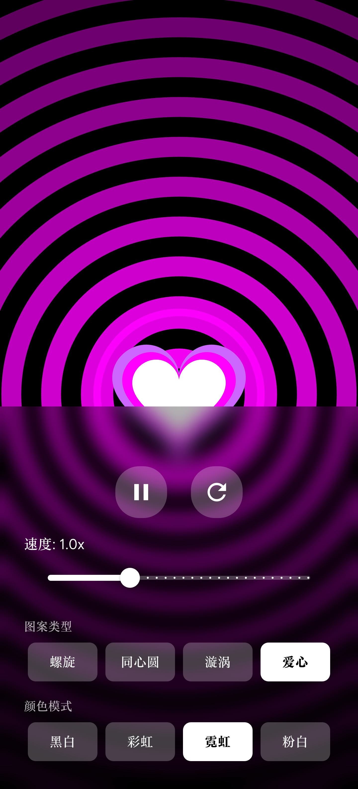

# Saimin Hypnosis

基于 Flutter 实现的催眠 APP，支持四种催眠图案展示，并提供四种配色组合。

本项目仅为参考本子里催眠 APP 的整活，**无真实催眠作用**。

## 界面

应用默认全屏展示，长按弹出控制面板。




## 技术栈

| 技术 | 版本 / 说明 | 作用 |
|------|-----------|------|
| Flutter | SDK ^3.10.4 | 跨平台 UI 框架 |
| Dart | SDK ^3.10.4 | 开发语言 |
| Material 3 | ThemeData.useMaterial3=true | 现代设计语言 |
| CustomPaint/CustomPainter | Flutter 内置 | Canvas 绑图形渲染 |
| AnimationController | Flutter 内置 | 动画控制 |

## 项目结构

```
saimin_app/
├── lib/
│   ├── main.dart                 # 应用入口，MaterialApp 配置
│   ├── screens/
│   │   └── hypnosis_screen.dart  # 主屏幕，状态管理与动画控制
│   ├── painters/
│   │   ├── spiral_painter.dart   # 阿基米德螺旋绘制
│   │   ├── circles_painter.dart  # 同心圆绘制
│   │   ├── vortex_painter.dart   # 漩涡曲线绘制
│   │   └── heart_painter.dart    # 爱心图案绘制
│   ├── widgets/
│   │   └── control_panel.dart    # 控制面板组件
│   └── models/
│       ├── pattern_type.dart     # 图案类型枚举
│       └── color_mode.dart       # 配色模式枚举
│   └── services/
│       └── settings_service.dart    # 配置持久化服务
├── pubspec.yaml                  # 依赖配置
└── analysis_options.yaml         # 代码规范配置
```

### 目录职责

| 目录 / 文件 | 职责 |
|-----------|------|
| `main.dart` | 应用入口，配置主题和路由 |
| `screens/` | 页面组件，包含业务逻辑 |
| `painters/` | CustomPainter 实现，负责 Canvas 绑制 |
| `widgets/` | 可复用的 UI 组件 |
| `models/` | 数据模型和枚举定义 |
| `services/` | 业务服务，如配置持久化 |

## 开发命令

### 构建发布

```bash
# 构建 Windows 发布版
flutter build windows

# 构建 Android APK
flutter build apk --release

# 仅构建 arm64 Android APK 
flutter build apk --target-platform android-arm64

# 理论支持全平台，其余平台构建自行参考 flutter 官方文档
```

---

本项目仅为个人 Flutter 学习项目。